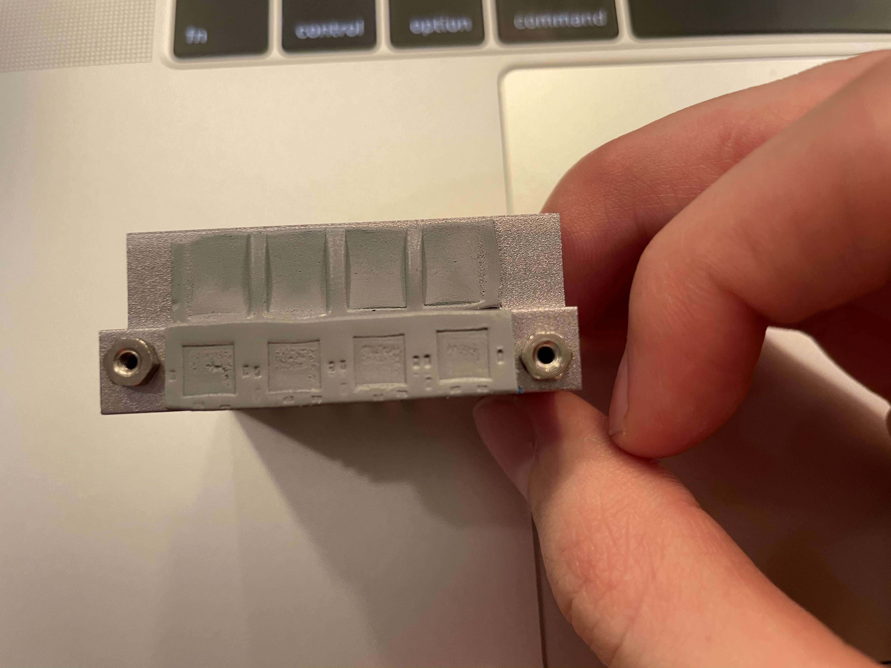
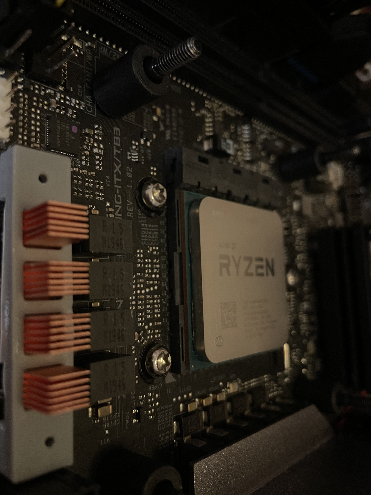
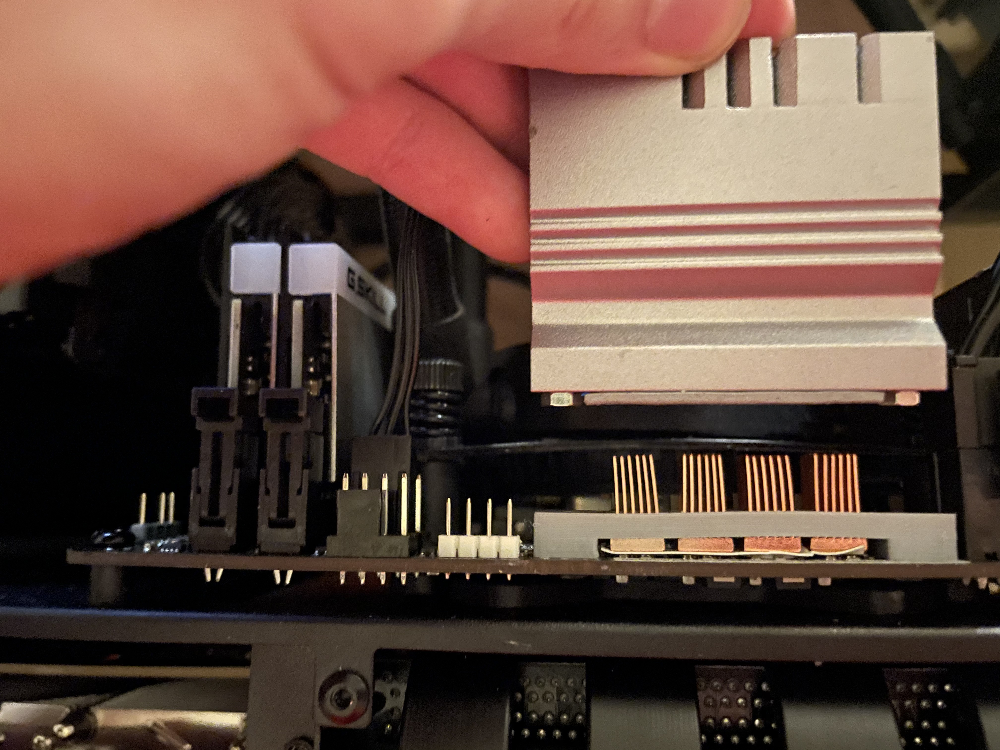

+++
title = "x570 itx tb3 heatsink"
date = 2021-01-05
[taxonomies]
tags=["3dprinting"]
+++

## the problem

The default upper MOSFET heatsink on the ASRock X570 ITX TB3 is too big. It's unwieldy, blocks airflow, and worst of all, not better at sinking heat when compared to smaller solutions.

<!-- more -->

{{ imgcap(src="BDD112F5-F7EE-44CE-9F4C-A5A8D8D8D728.jpeg", alt="photo of asrock's terrible heatsink" cap="The offending heatsink, laptop keys
for scale.") }}

The heatsink is supposed to cover two surfaces on the motherboard — a row of [MOSFETs](https://www.renesas.com/us/en/document/dst/isl99227-isl99227b-datasheet), and a row of chokes. What those *do* isn't particularly important in the context of what we're doing: we just need to remember that of the two, the MOSFETs generate more heat for their comparatively smaller size. Sticking some kind of heat dissipating surface on the MOSFETs is necessary, while it's less necessary for the chokes.

Also of interest is the method with which this heatsink is mounted to the board. A screw is threaded through a hole on the board and into a nut affixed to the heatsink. The nut seems to be glued (!!!) onto the heatsink, as opposed to some kind of through hole machined into the surface. 

## the solution

With these constraints in mind, I selected a heatsink suitable for the MOSFETs from [Amazon](https://smile.amazon.com/gp/product/B077VQTB6Q/) at the suggestion at the suggestion of [this Reddit post](https://old.reddit.com/r/sffpc/comments/daj1rd/vrm_heatsink_swap_on_asrock_x570_itxtb3/). They look like this:

{{ imgcap(alt="photo of heatsink, laptop keyboard for scale", src="147FFDD9-4605-47FE-BEB6-061F02C46ABD.jpeg", cap="Sorry for the terrible photo.") }}

These heatsinks are around 6.5x6.5x10mm. The base has a lip that I used to secure the heatsink to the motherboard with a part that I designed with SCAD.

{{ imgcap(src="Untitled.png" alt="screenshot of OpenSCAD" cap="Ignore all the duplicate statements
and magic numbers. It works, I swear!")}}

## results

Whenever I design a physical part, I always roughly follow this procedure:

1. Figure out the constraints and roughly approximate how the part "should" look
   1. Are there any screw holes or distinguishing features? Measure offsets for those and write them down.
2. Plug those constraints into SCAD, combine objects and extrudes until it looks right
3. Print a copy out, realize that I screwed up the tolerances
4. Repeat step 1

This part was easier than most — I churned through four or so iterations before I converged on something usable. Its small footprint helped. To be honest, I'm not entirely sure if the MOSFETs are any warmer or cooler. I wish I had concrete numbers, but it doesn't seem like there's a way to trivially access the MOSFETs' onboard temperature sensors. The computer seems to still function and as far as I can tell, the CPU is boosting normally. The motherboard even looks prettier! I'll file that under "win".
